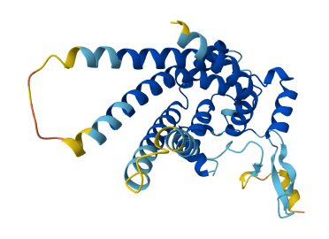
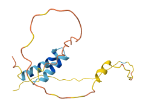
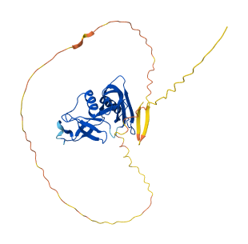

## MTCH2

<a href="https://assets-eu.researchsquare.com/files/rs-8779983/v1_covered_d705db6b-eace-4b06-a463-d4394c05d537.pdf?c=1772550776" target="_blank">Research Square Preprint</a> | <a href="https://alphafold.ebi.ac.uk/entry/AF-Q9Y6C9-F1" target="_blank">AlphaFold Entry</a> 

### Combining cell type-specific genomic/epigenomic analyses and experimental validation identifies genetic drivers across three neurodegenerative diseases
#### Abstract
The genetic underpinnings of neurodegenerative disease risk remain poorly characterized due to the lack of a unified framework for synthesizing causal evidence from diverse statistical and biological sources. Here, we present an integrative approach to analyze Alzheimer’s disease (AD), Parkinson’s disease (PD), and amyotrophic lateral sclerosis (ALS) risk that unifies evidence from Mendelian randomization, colocalization, cell type-specific genomic and epigenomic profiling, human induced pluripotent stem cell (iPSC) and mouse model-based functional validation. We identified 173 high confidence risk genes: 105 for AD, 50 for PD, and 27 for ALS. Single-nucleus multi-omics revealed distinct cell type-specific regulatory architectures, with AD risk genes enriched in microglia and PD and ALS risk genes predominantly associated with neurons and oligodendrocytes. Functional mechanisms were elucidated for specific variants, including a non-coding variant (rs1171832) that regulates expression of the DNA repair and cell cycle CCDC6 gene by modulating chromatin accessibility in microglia and we further validate it in human iPSC derived microglia by CRISPRi experiments. A nonsynonymous mutation (p.P290A) in the mitochondrial metabolism gene MTCH2 (rs1064608) that increases its neuronal expression and elevates AD risk. We found that AAV-mediated delivery of mutated MTCH2 gene ameliorated cognitive deficits in a mouse model, indicating a protective role. This work establishes a functional genomic framework that bridges genetic association with molecular mechanism and target validation, uncovering cell type-specific genetic drivers of neurodegenerative diseases.

----

## CHCHD10

<a href="https://pubmed.ncbi.nlm.nih.gov/42348392/" target="_blank">PubMed</a> | <a href="https://alphafold.ebi.ac.uk/entry/AF-Q8WYQ3-F1" target="_blank">AlphaFold Entry</a> 

### CHCHD10 Mitigates Alzheimer's Disease-Related Phenotypes in Association With Epigenetic Remodeling in Directly Reprogrammed Neurons
#### Abstract
Mitochondrial dysfunction and chromatin dysregulation are interconnected contributors to neuronal vulnerability in Alzheimer's disease (AD), yet the molecular mechanisms linking these processes remain poorly understood. CHCHD10, a mitochondrial intermembrane space protein, has been implicated in neurodegenerative disorders, but its role in AD has not been defined. Here, we identify CHCHD10 as a previously unrecognized modulator of neuronal epigenomic stability in AD. Using direct fibroblast-to-neuron reprogramming, which preserves patient-specific epigenetic signatures, we show that AD neurons recapitulate genome-wide hypomethylation patterns observed in postmortem AD cortex. CHCHD10 expression is significantly reduced in AD neurons and across multiple human brain datasets, including single-cell and bulk RNA sequencing, proteomics, and human cortical tissue analyses. Restoration of CHCHD10 in AD neurons reduces amyloid-β and insoluble tau accumulation while reversing AD-associated differentially methylated regions across CpG islands, promoters, and regulatory elements. CHCHD10-responsive methylation changes overlap with those observed in human AD brain regions and colocalize with significant AD loci and cortex-specific eQTL loci, including MAPT and ABCA7. Finally, we identify KATNAL2 as a CHCHD10-responsive effector whose loss enhances tau phosphorylation and seeding, whereas its restoration mitigates tau pathology. Together, these findings support a CHCHD10-associated neuroprotective pathway linking mitochondrial dysfunction, epigenomic instability, and tau pathology in AD.

----

## APP E590D

<a href="https://pubmed.ncbi.nlm.nih.gov/41816611/" target="_blank">PubMed</a> | <a href="https://alphafold.ebi.ac.uk/entry/AF-P05067-2-F1" target="_blank">AlphaFold Entry</a> 

### APP E590D mutation increases generation of Aβ and Aη peptides and exacerbates tauopathy
#### Abstract
Accumulation of Amyloid β (Aβ), a peptide derived from endocytic processing of the amyloid precursor protein (APP), is a critical initial step in the development of Alzheimer's disease (AD). While the APP695^E590D mutation was previously discovered in 2 pathologically confirmed AD patients, the pathogenicity of this mutation has remained uncertain due to its exceptional rarity. Here, we characterize the APP695E590D mutation by evaluating multiple APP metabolites and determining its effects on tauopathy in cellular and animal models. We show that APP695E590D not only increases Aβ through endocytic β-secretase processing but also increases Aη, an alternative APP-derived synaptotoxic peptide. We further demonstrate that APP695E590D promotes tauopathy by increasing tau seeding and aggregation in cellular models and exacerbating phospho-tau pathology and neuroinflammation in tauP301S mice. These results reveal a unique modality by which APP695E590D impinges on AD pathology by enhancing both Aβ and Aη generation and accelerating tauopathy.

